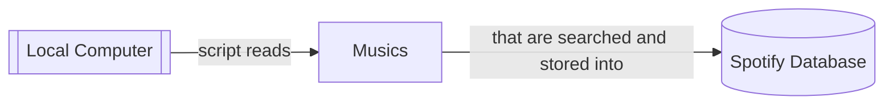
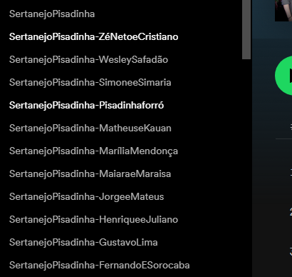

# spotify music creator

This repository contains a simple script that will read your local repository
and then, it'll create playlists and assign your musics to them.

IMPORTANT: this script won't copy your local music

IMPORTANT: this script don't ensure that the musics are correct (the music matching depends only of
spotify algorithms)

IMPORTANT: this script may not work for some musics (if it's some remix or if it don't exist in
spotify db)

     
    
     
    <b>Example</b>

## Requirements

- python 3.10
- spotify account
- jupyter server/notebook
